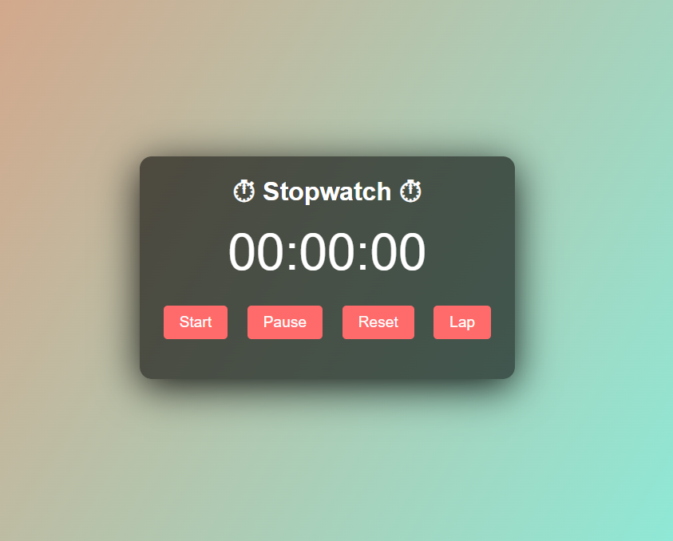
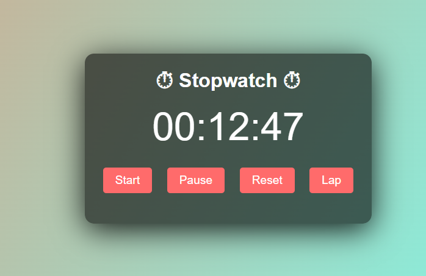
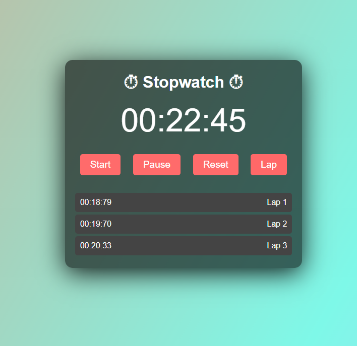

# **Stopwatch Web Application** ⏱️✨

An engaging, interactive, and user-friendly stopwatch web application crafted to precisely measure and record time intervals. Featuring a sleek design and powerful functionality, this app ensures an exceptional user experience.

---

## **Features** 🌟

- 🚀 **Start, Pause, and Reset**: Intuitive buttons for effortless control.
- ⏲️ **Lap Time Tracking**: Record and view multiple lap times during a session.
- 💡 **Real-Time Display**: Seamlessly updates for precise timekeeping.
- 📱 **Responsive Design**: Fully optimized for desktop, tablet, and mobile devices.
- 🎨 **Interactive Interface**: A clean and modern layout for an engaging experience.

---

## **Technologies Used** 🛠️

- **HTML5**: For structuring content.
- **CSS3**: For dynamic styling and responsive design.
- **JavaScript**: Implements stopwatch logic and interactivity.

---

## **Installation and Usage** 🚀

1. **Clone the repository**:
   ```bash
   git clone https://github.com/CornHaki/PRODIGY_WD_02.git
   ```

2. **Navigate to the project directory**:
   ```bash
   cd PRODIGY_WD_02
   ```

3. **Open the application**:
   Open `index.html` directly in your browser or use a live server.

---

## **Screenshots** 📸

### **Take a Look at the Application in Action**




---

## **Folder Structure** 📂
```plaintext
project-directory/
└── assets/
       ├── image1.png
       ├── image2.png
       └── image3.png
├── README.md           # Project description and details
├── index.html          # Main HTML file
├── script.js           # JavaScript file for stopwatch logic
└── styles.css          # CSS file for styling
```

---

## **Author** 🖋️
**Dimpal Baishya**

---

## **Contact Me** 📨

Feel free to connect with me for feedback or collaborations:

- 📧 **Email**: baishyadimpal31@gmail.com

---

